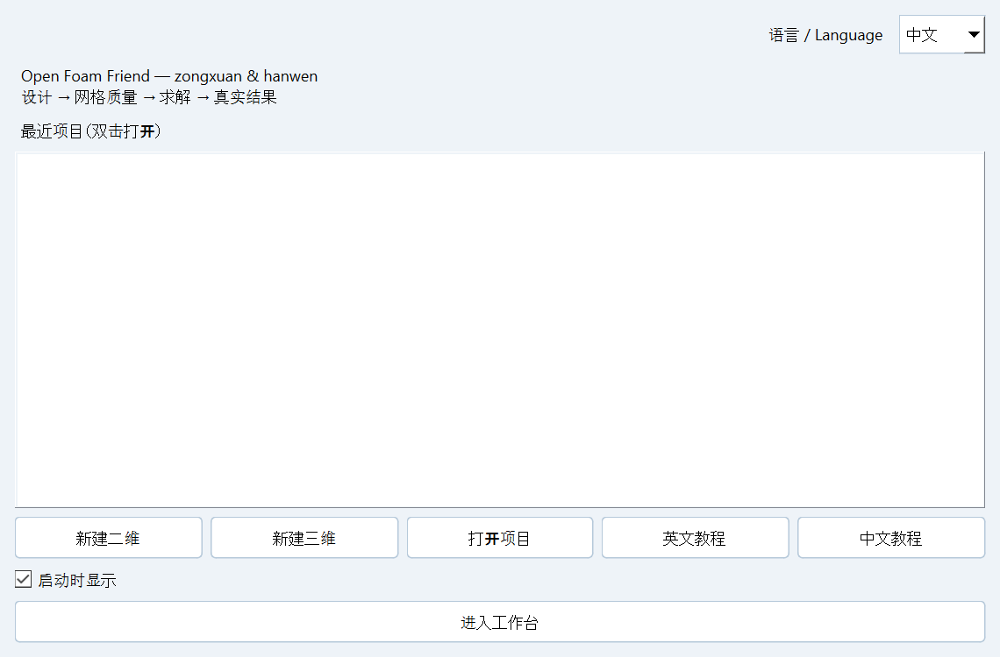
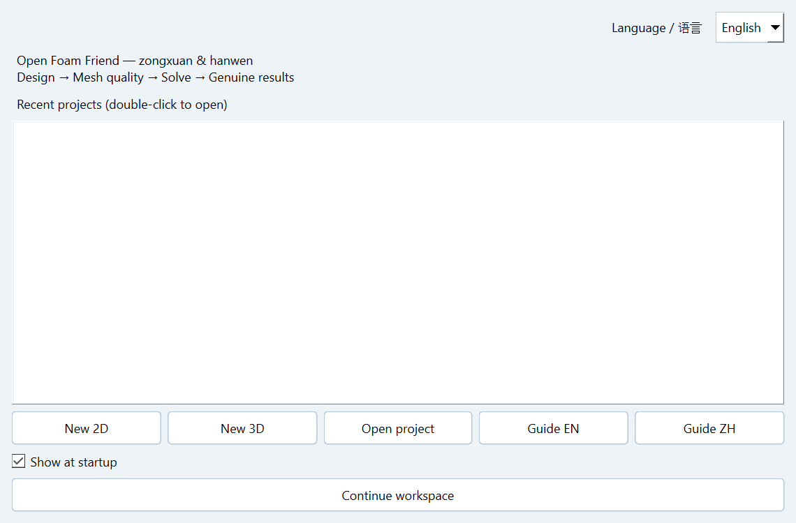

<p align="center"></p>

# OpenFOAM Friend

**几何与网格设计、OpenFOAM 求解和科学后处理的 Windows 桌面工作台。**  
**A Windows desktop workbench for geometry, meshing, OpenFOAM execution and scientific post-processing.**

**作者 / Authors：zongxuan & hanwen** · **版本 / Version：0.17.0**  
**开源协议 / Open-source license：[GNU GPL v3 or later / GPL-3.0-or-later](LICENSE)**

[中文说明](#中文说明) · [English](#english) · [纯中文版本](README.zh-CN.md) · [English-only version](README.en.md)

[下载 / Download](https://mkdhxy.github.io/OpenFOAMFriend/) · [Release](https://github.com/MKDHXY/OpenFOAMFriend/releases/tag/v0.17.0) · [Help / 帮助](https://mkdhxy.github.io/OpenFOAMFriend/help.html) · [建议与提问 / Issues](https://github.com/MKDHXY/OpenFOAMFriend/issues)

网站说明正文同时展示中英文；顶部 **Language** 切换导航、按钮与标题，首次打开默认为 **English**。

Website descriptions show both English and Chinese. The top **Language** selector changes navigation, buttons and headings; the first visit defaults to **English**.

## 开源协议 / Open-source license

本项目应用源码采用 **GNU General Public License v3.0 or later（GPL-3.0-or-later）**。作者为 **zongxuan 与 hanwen**。依照协议条款，可以使用、研究、修改和再分发；分发修改版时应遵守 GPL 的许可证及对应源码要求。第三方组件保留原有版权和许可证。

The application is licensed under **GNU General Public License v3.0 or later (GPL-3.0-or-later)**, by **zongxuan and hanwen**. Use, study, modification and redistribution are permitted under its terms; distributed modifications must comply with GPL licensing and corresponding-source requirements. Third-party components retain their own copyright and license terms.

[协议全文 / Full LICENSE](LICENSE) · [中英许可说明 / Bilingual guide](LICENSE_GUIDE.md) · [第三方声明 / NOTICE](NOTICE)

## 中文说明

### 下载与安装

两个包均自带 Windows 运行环境，**不需要先安装 Python**。完整解压 ZIP 后双击 `Setup.cmd`，不要在压缩包内启动或只复制启动文件。

| 软件包 | 下载 | 适用情况 |
| --- | --- | --- |
| FULL 完整包 | [Windows x64 离线环境包](https://github.com/MKDHXY/OpenFOAMFriend/releases/download/v0.17.0/OpenFOAMFriend_FULL_v0.17.0_windows_x64.zip) | 自带 Python/Qt/VTK/Gmsh、Microsoft WSL MSI，以及预装 OpenFOAM14/OpenMPI 的干净 Ubuntu24.04 镜像。 |
| LITE 简易包 | [Windows x64 软件与诊断包](https://github.com/MKDHXY/OpenFOAMFriend/releases/download/v0.17.0/OpenFOAMFriend_LITE_v0.17.0_windows_x64.zip) | 同样自带软件环境；缺少 WSL/OpenFOAM 时只提示，不安装 Linux 或系统组件。 |

[SHA-256 校验](https://github.com/MKDHXY/OpenFOAMFriend/releases/download/v0.17.0/SHA256SUMS.txt) · [中文安装说明](https://mkdhxy.github.io/OpenFOAMFriend/installation_ZH.html) · [English installation](https://mkdhxy.github.io/OpenFOAMFriend/installation_EN.html)

**系统要求：**Windows10 build19041+ / Windows11，Intel/AMD x64；至少10GB可用空间，建议15GB以上。首次启用 WSL 需要管理员权限、BIOS/UEFI 虚拟化支持，可能手动重启。本包不能绕过单位策略，不包含 Windows 操作系统，不提供 ARM64/macOS/原生 Linux GUI 版本。

**欢迎页、安装器和设置内均可选择中文 / English。**

### 全流程功能

| 环节 | 已有功能 |
| --- | --- |
| 几何 | 带尺寸二维绘图、两点直线、圆弧与实体、区域划分、三维挤出预览与视角控制。 |
| 网格 | 结构圆柱 O-grid、分区矩形、手动拓扑/blockMesh/Gmsh、三角形/棱柱、四边形为主和四面体；均匀或渐变间距。 |
| 质量 | 真实 `checkMesh`，偏斜度、非正交性、纵横比、阈值检查与问题面定位。 |
| 求解 | Foundation14 `foamRun` + `incompressibleFluid`、PIMPLE、类型化湍流模型目录、核心预算队列、暂停继续、恢复与轮询设置。 |
| 后处理 | VTK 场显示、播放、可调色条、速度/压力/涡量、完整 `.foam`、CSV/GIF/MAT 导出、未加窗单边力系数 FFT。 |
| 超算 | OpenSSH + Slurm 配置、批处理代码审阅与监控；需要你自己的超算账号。 |



### 实际验证与边界

本次新跑三组三维流程，每组 **5,120 单元、4 MPI 核心**，覆盖结构 O-grid、手动 Gmsh 和 `kOmegaSST`。MAT/CSV/GIF 与重构 `.foam` 实际导出，并检查有限值、真实时间点和网格可读性。终止时间为0.04/0.06/0.10s；这是安装及流程验证，**不是物理或统计收敛证明**。

已实际把干净镜像导入独立 WSL 实例，验证含中文和空格目录的安装、自带 Python 隔离运行、本地 C++ DLL、欢迎页语言切换及原功能回归。[详细验证证据](docs/verification/package_verification.html)。

**未验证范围：**本机为已有 WSL 的 Windows10 19045 x64。另一台裸机的 BIOS/UAC/重启全程、所有 Windows11/GPU 配置、真实生产超算提交没有完整实测。本版本为科研工程版本，不是工业认证或完整 ParaView 替代。自带 OpenSSH 客户端是 NOTICE 标明的 Microsoft 上游预览版。

### 文档与支持

[中文手册](docs/manual_ZH.html) · [English manual](docs/manual_EN.html) · [快速教程](docs/quickstart_ZH.html) · [反馈问题](https://github.com/MKDHXY/OpenFOAMFriend/issues/new/choose) · [帮助网站](http://spaceaero.space)

### 从源码启动

开发者需要 Python3.12 x64：

```powershell
py -3.12 -m venv .venv
.\.venv\Scripts\python.exe -m pip install -r requirements.txt
.\.venv\Scripts\python.exe app.py
```

计算环境可用 FULL 包安装，或在软件中配置已有 Foundation14 WSL 发行版。[构建说明](BUILDING.md) · [贡献说明](CONTRIBUTING.md)。

### 许可证与署名

[开源协议全文](LICENSE) · [中英许可说明](LICENSE_GUIDE.md) · [第三方声明](NOTICE)

应用源码：[GPL-3.0-or-later](LICENSE)。作者：**zongxuan 和 hanwen**。第三方许可保留原条款，详见 [NOTICE](NOTICE)。本项目与上游机构独立，没有官方背书。引用信息见 [CITATION.cff](CITATION.cff)。


## English

### Download and install

No system Python is needed for either package. Extract the entire ZIP, then double-click `Setup.cmd`. Do not run inside the ZIP or copy a launcher alone.

| Package | Download | Intended computer |
| --- | --- | --- |
| FULL | [Windows x64 · complete offline environment](https://github.com/MKDHXY/OpenFOAMFriend/releases/download/v0.17.0/OpenFOAMFriend_FULL_v0.17.0_windows_x64.zip) | Includes app-local Python/Qt/VTK/Gmsh, signed Microsoft WSL MSI, and a clean Ubuntu24.04 image with OpenFOAM14 and OpenMPI. |
| LITE | [Windows x64 · app and diagnostics](https://github.com/MKDHXY/OpenFOAMFriend/releases/download/v0.17.0/OpenFOAMFriend_LITE_v0.17.0_windows_x64.zip) | Includes the same Windows runtime. Missing WSL/OpenFOAM is reported; Linux/system components are never installed. |

[SHA-256 checksums](https://github.com/MKDHXY/OpenFOAMFriend/releases/download/v0.17.0/SHA256SUMS.txt) · [English installation guide](https://mkdhxy.github.io/OpenFOAMFriend/installation_EN.html) · [中文安装指南](https://mkdhxy.github.io/OpenFOAMFriend/installation_ZH.html)

**Requirements:** Windows10 build19041+ or Windows11 on Intel/AMD x64; 10GB free minimum, 15GB+ recommended. FULL first-time WSL enablement needs administrator permission, BIOS/UEFI virtualization and possibly a manual restart. The package does not bypass corporate policy or include the Windows operating system. ARM64/macOS/native Linux GUI builds are not supplied.

Language can be changed directly on the welcome page and in Settings; the installer also supports Chinese/English.

### Workflow

| Stage | Available operations |
| --- | --- |
| Geometry | Dimensioned 2D sketching, two-click lines, arcs/shapes, regions, 3D extrusion preview and camera controls. |
| Meshing | Structured cylinder O-grid, partitioned box, manual topology/blockMesh/Gmsh, triangular/prismatic, quad-dominant and tetrahedral generation; uniform and graded spacing. |
| Quality | Actual `checkMesh` results, skewness/non-orthogonality/aspect ratio, quality thresholds and offending-face locations. |
| Execution | OpenFOAM Foundation14 `foamRun` + `incompressibleFluid`, PIMPLE controls, typed turbulence-model catalogue, CPU-budgeted queue, pause/continue, checkpoint recovery and configurable polling. |
| Results | VTK field views, playback, adjustable colour maps, velocity/pressure/vorticity, complete `.foam` case export, CSV/GIF/MAT and single-sided unwindowed force FFT. |
| Remote | OpenSSH + Slurm configuration, reviewed batch scripts and monitoring. A real remote cluster account is required. |



### Measured verification

Three fresh 3D cases were executed with **5,120 cells and four MPI ranks**, covering structured O-grid, manual Gmsh topology and `kOmegaSST`. Real MAT/CSV/GIF and reconstructed `.foam` exports were checked for finite fields, genuine times and readable meshes. End times were 0.04/0.06/0.10s; these are workflow tests, **not physical/statistical convergence evidence**.

The clean Linux image was actually imported into independent WSL distributions. App installation in a Chinese/space-containing directory, isolated Python imports, app-local C++ runtime DLLs, welcome-language changes and interface regressions were verified. [Detailed evidence](docs/verification/package_verification.html).

**Qualification boundary:** the physical host was Windows10 19045 x64 with WSL already enabled. A new computer's BIOS/UAC/reboot sequence, all Windows11/GPU combinations and end-to-end submission to a production cluster were not physically tested. This is a research engineering release, not commercial CFD certification or a complete ParaView replacement. The bundled OpenSSH client is the upstream Microsoft preview identified in NOTICE.

### Documentation and support

[English manual](docs/manual_EN.html) · [中文手册](docs/manual_ZH.html) · [English quickstart](docs/quickstart_EN.html) · [中文快速教程](docs/quickstart_ZH.html) · [Report a reproducible issue](https://github.com/MKDHXY/OpenFOAMFriend/issues/new/choose) · [Help website](http://spaceaero.space)

### Run from source

For developers with Python3.12 x64:

```powershell
py -3.12 -m venv .venv
.\.venv\Scripts\python.exe -m pip install -r requirements.txt
.\.venv\Scripts\python.exe app.py
```

Use the packaged FULL installer for a prepared Linux environment, or configure your existing Foundation14 distribution under WSL connection settings. See [BUILDING.md](BUILDING.md) and [CONTRIBUTING.md](CONTRIBUTING.md).

### License and attribution

[Full license](LICENSE) · [Bilingual license guide](LICENSE_GUIDE.md) · [Third-party notices](NOTICE)

Application: [GPL-3.0-or-later](LICENSE). Authors: **zongxuan and hanwen**. Dependencies retain their original terms; see [NOTICE](NOTICE). OpenFOAM Friend is independent and is not endorsed by upstream projects. Cite software metadata in [CITATION.cff](CITATION.cff).
