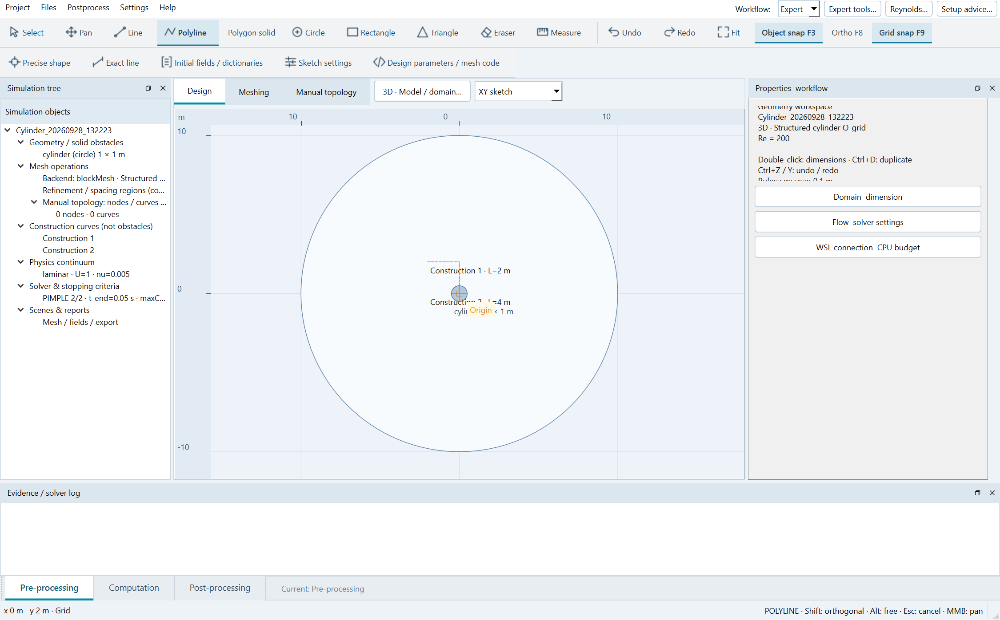
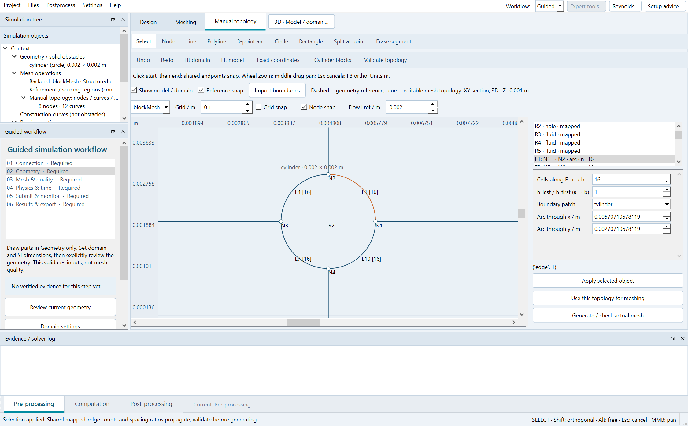
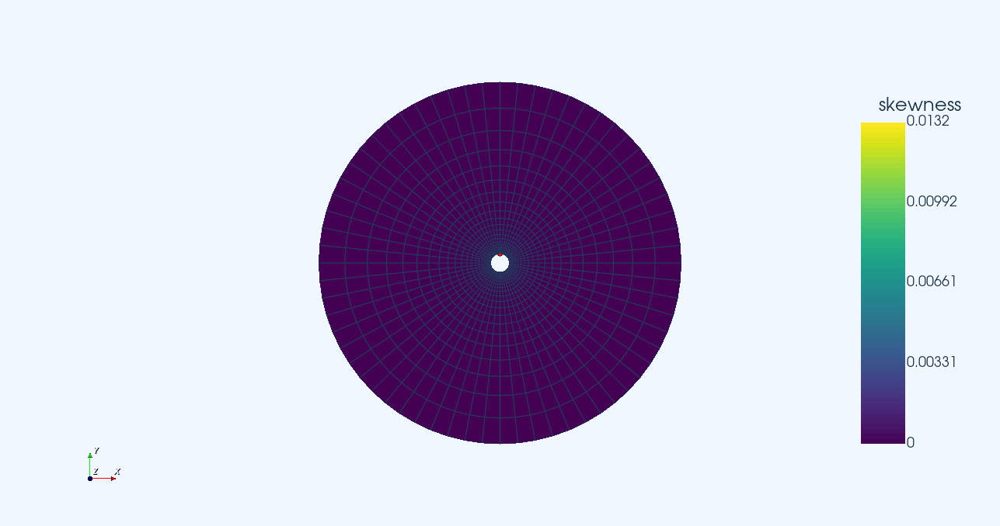
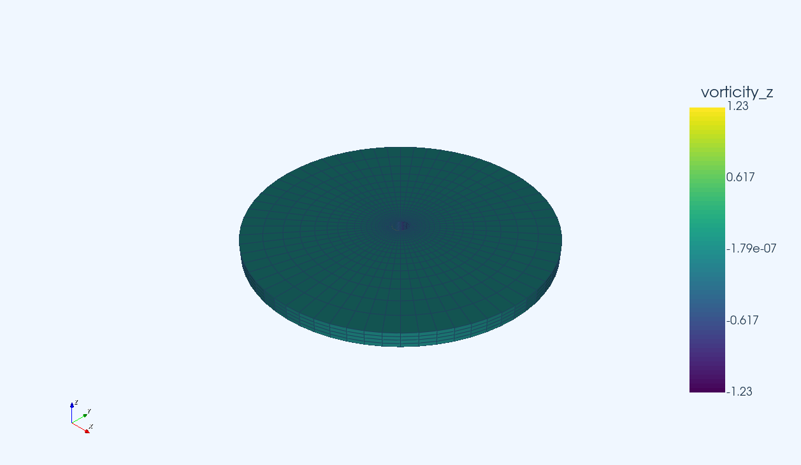
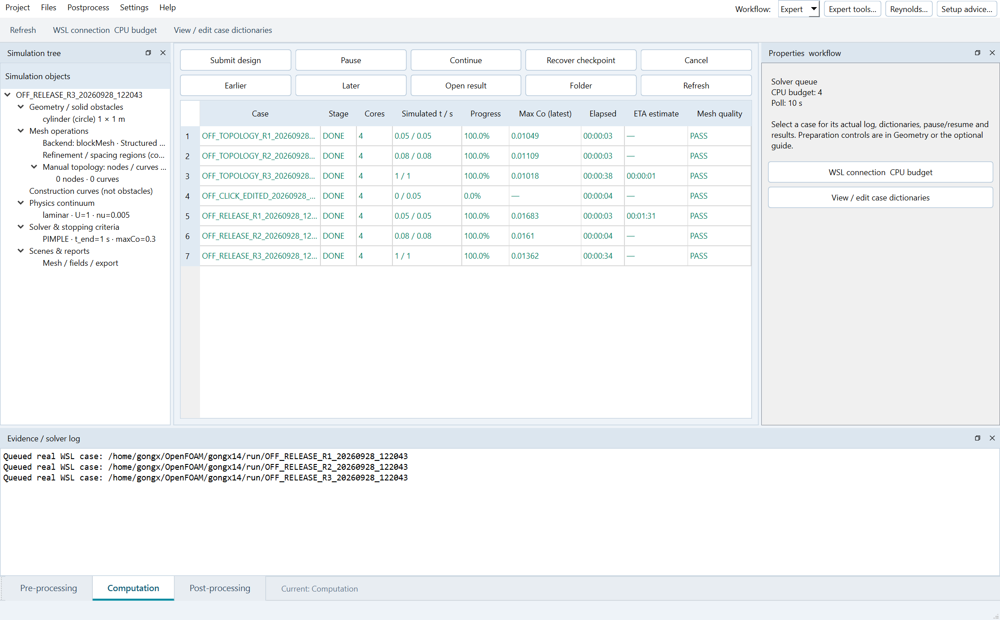
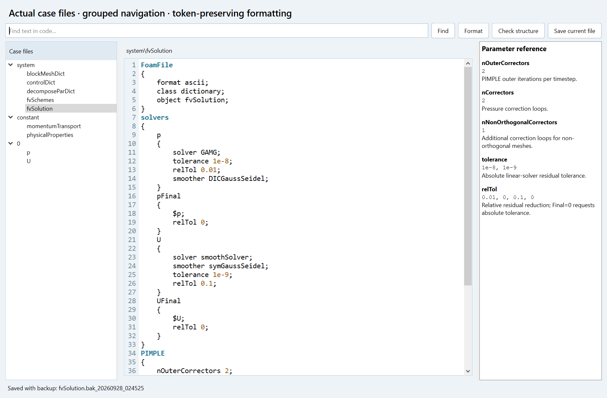
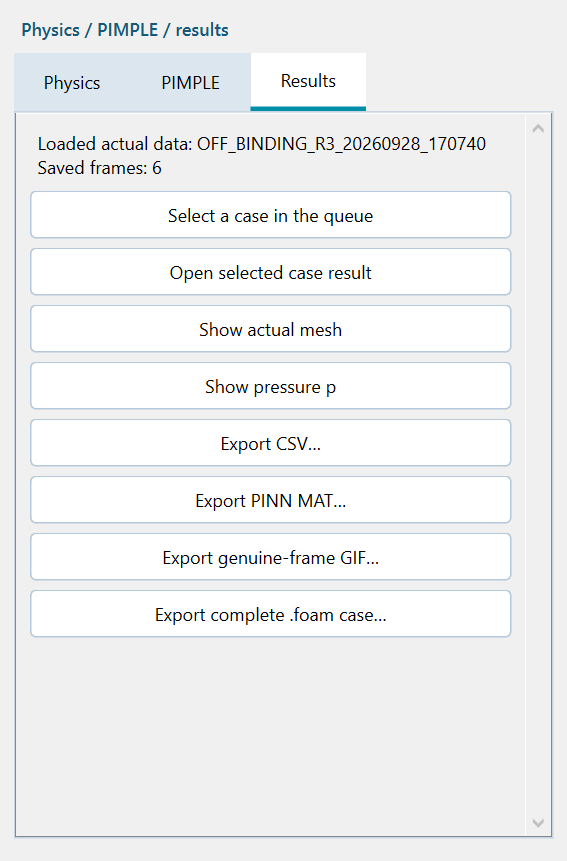
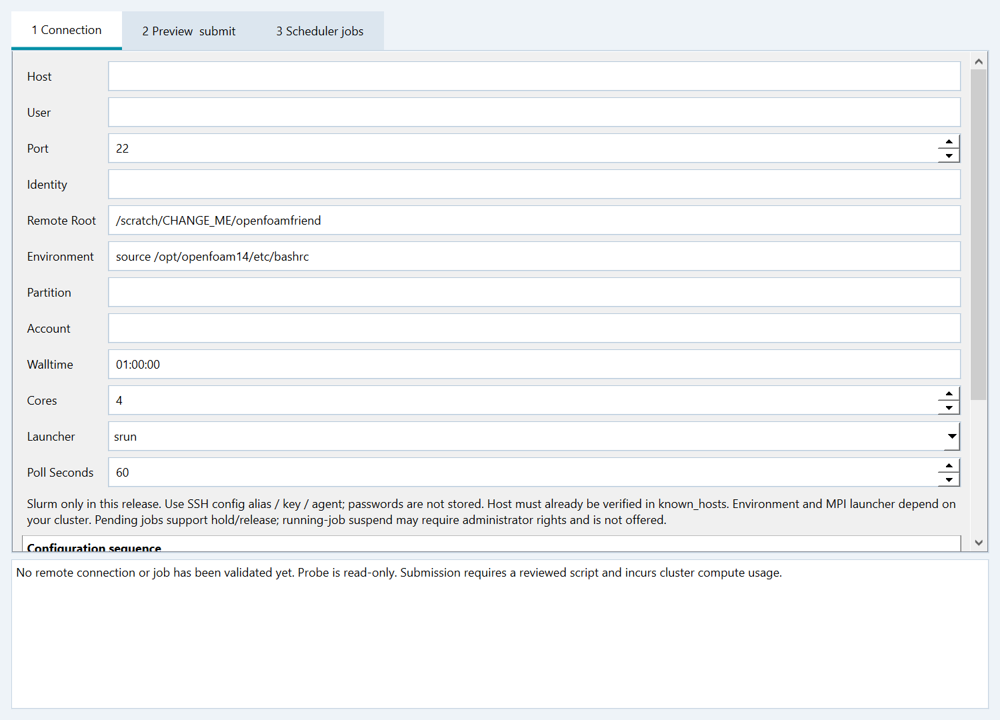

<p align="center"></p>

**Language:** [English](https://github.com/MKDHXY/OpenFOAMFriend#readme) | **中文**

# OpenFOAM Friend

A Windows desktop workbench for geometry, mesh design, OpenFOAM execution and scientific post-processing.

面向 Windows 的科研桌面工作台，串联几何建模、网格设计、OpenFOAM 求解与科学后处理。

**作者：** zongxuan 与 hanwen · **版本：** 0.17.0 · **开源协议：** [GPL-3.0-or-later](LICENSE)

[下载](https://mkdhxy.github.io/OpenFOAMFriend/?lang=zh) · [发布版本](https://github.com/MKDHXY/OpenFOAMFriend/releases/tag/v0.17.0) · [帮助](https://mkdhxy.github.io/OpenFOAMFriend/help.html?lang=zh) · [提问与建议](https://github.com/MKDHXY/OpenFOAMFriend/issues) · [协议全文](LICENSE)

### 在一个可视化工作台完成 OpenFOAM 科研流程

**绘制几何 → 制造网格 → 并行计算 → 查看与导出结果**

**[下载 FULL 完整包](https://github.com/MKDHXY/OpenFOAMFriend/releases/download/v0.17.0/OpenFOAMFriend_FULL_v0.17.0_windows_x64.zip)** · **[下载 LITE 简易包](https://github.com/MKDHXY/OpenFOAMFriend/releases/download/v0.17.0/OpenFOAMFriend_LITE_v0.17.0_windows_x64.zip)** · [快速教程](https://mkdhxy.github.io/OpenFOAMFriend/quickstart_ZH.html)



| 设计与网格 | 求解与管理 | 科研与数据 |
| --- | --- | --- |
| 带尺寸绘图、手动拓扑、blockMesh / Gmsh、均匀与渐变间距 | WSL 环境、核心预算、PIMPLE、模型配置与计算队列 | 网格质量、真实场可视化、CSV / GIF / MAT / .foam 导出 |

## 看看软件能做什么

### 绘图与手动网格拓扑

在同一工作区查看模型和流场，编辑节点、直线、圆弧与区域，并指定分段数、渐变间距和边界。引导模式和专家模式都可用。



### 查看真实网格与物理场

检查网格质量并定位问题面；切换速度、压力或涡量，查看真实保存的场和可调色条。下图为软件导出的示例视图。

| 网格质量 · skewness | 后处理 · vorticity_z |
| --- | --- |
| [](docs/media/showcase/mesh_quality.png) | [](docs/media/showcase/vorticity_view.png) |

### 提交、排队、监控

选择核心预算，查看算例阶段、物理时间、最新 Courant 数与日志，管理暂停、继续及检查点恢复。图中数据来自实际流程测试。



### 查看并编辑生成的 OpenFOAM 文件

按目录浏览网格、求解器、物性及初始场文件；编辑器提供行号、格式化、结构检查与参数参考。



<details>
<summary><strong>更多界面：结果导出与 SSH / Slurm 配置</strong></summary>

#### 导出用于科研与 PINN 的数据

从已加载的真实场导出 CSV、xytuvp MAT、GIF 和完整 `.foam` 算例。



#### 配置远程计算

设置主机、密钥、远端 OpenFOAM 环境、分区、核心数与轮询周期，并审阅提交脚本。需要自己的超算账号；当前发布尚未完成生产集群作业验证。



</details>

截图来自实际软件验证记录；部分功能图为英文界面，软件可切换中文。[查看截图来源记录](docs/media/showcase/provenance.json)。

## 下载与安装

两个包均自带 Windows 运行环境，**不需要先安装 Python**。完整解压 ZIP 后双击 `Setup.cmd`，不要在压缩包内启动或只复制启动文件。

| 软件包 | 下载 | 适用情况 |
| --- | --- | --- |
| FULL 完整包 | [Windows x64 离线环境包](https://github.com/MKDHXY/OpenFOAMFriend/releases/download/v0.17.0/OpenFOAMFriend_FULL_v0.17.0_windows_x64.zip) | 自带 Python/Qt/VTK/Gmsh、Microsoft WSL MSI，以及预装 OpenFOAM14/OpenMPI 的干净 Ubuntu24.04 镜像。 |
| LITE 简易包 | [Windows x64 软件与诊断包](https://github.com/MKDHXY/OpenFOAMFriend/releases/download/v0.17.0/OpenFOAMFriend_LITE_v0.17.0_windows_x64.zip) | 同样自带软件环境；缺少 WSL/OpenFOAM 时只提示，不安装 Linux 或系统组件。 |

[SHA-256 校验](https://github.com/MKDHXY/OpenFOAMFriend/releases/download/v0.17.0/SHA256SUMS.txt) · [中文安装说明](https://mkdhxy.github.io/OpenFOAMFriend/installation_ZH.html) · [English installation](https://mkdhxy.github.io/OpenFOAMFriend/installation_EN.html)

**系统要求：** Windows10 build19041+ / Windows11，Intel/AMD x64；至少10GB可用空间，建议15GB以上。首次启用 WSL 需要管理员权限、BIOS/UEFI 虚拟化支持，可能手动重启。本包不能绕过单位策略，不包含 Windows 操作系统，不提供 ARM64/macOS/原生 Linux GUI 版本。

**欢迎页、安装器和设置内均可选择中文 / English。**

## 全流程功能

| 环节 | 已有功能 |
| --- | --- |
| 几何 | 带尺寸二维绘图、两点直线、圆弧与实体、区域划分、三维挤出预览与视角控制。 |
| 网格 | 结构圆柱 O-grid、分区矩形、手动拓扑/blockMesh/Gmsh、三角形/棱柱、四边形为主和四面体；均匀或渐变间距。 |
| 质量 | 真实 `checkMesh`，偏斜度、非正交性、纵横比、阈值检查与问题面定位。 |
| 求解 | Foundation14 `foamRun` + `incompressibleFluid`、PIMPLE、类型化湍流模型目录、核心预算队列、暂停继续、恢复与轮询设置。 |
| 后处理 | VTK 场显示、播放、可调色条、速度/压力/涡量、完整 `.foam`、CSV/GIF/MAT 导出、未加窗单边力系数 FFT。 |
| 超算 | OpenSSH + Slurm 配置、批处理代码审阅与监控；需要你自己的超算账号。 |


## 实际验证与边界

本次新跑三组三维流程，每组 **5,120 单元、4 MPI 核心**，覆盖结构 O-grid、手动 Gmsh 和 `kOmegaSST`。MAT/CSV/GIF 与重构 `.foam` 实际导出，并检查有限值、真实时间点和网格可读性。终止时间为0.04/0.06/0.10s；这是安装及流程验证，**不是物理或统计收敛证明**。

已实际把干净镜像导入独立 WSL 实例，验证含中文和空格目录的安装、自带 Python 隔离运行、本地 C++ DLL、欢迎页语言切换及原功能回归。[详细验证证据](docs/verification/package_verification.html)。

**未验证范围：** 本机为已有 WSL 的 Windows10 19045 x64。另一台裸机的 BIOS/UAC/重启全程、所有 Windows11/GPU 配置、真实生产超算提交没有完整实测。本版本为科研工程版本，不是工业认证或完整 ParaView 替代。自带 OpenSSH 客户端是 NOTICE 标明的 Microsoft 上游预览版。

## 文档与支持

[中文手册](docs/manual_ZH.html) · [English manual](docs/manual_EN.html) · [快速教程](docs/quickstart_ZH.html) · [反馈问题](https://github.com/MKDHXY/OpenFOAMFriend/issues/new/choose) · [帮助网站](http://spaceaero.space)

## 从源码启动

开发者需要 Python3.12 x64：

```powershell
py -3.12 -m venv .venv
.\.venv\Scripts\python.exe -m pip install -r requirements.txt
.\.venv\Scripts\python.exe app.py
```

计算环境可用 FULL 包安装，或在软件中配置已有 Foundation14 WSL 发行版。[构建说明](BUILDING.md) · [贡献说明](CONTRIBUTING.md)。

## 许可证与署名

[开源协议全文](LICENSE) · [中英许可说明](LICENSE_GUIDE.md) · [第三方声明](NOTICE)

应用源码：[GPL-3.0-or-later](LICENSE)。作者：**zongxuan 和 hanwen**。第三方许可保留原条款，详见 [NOTICE](NOTICE)。本项目与上游机构独立，没有官方背书。引用信息见 [CITATION.cff](CITATION.cff)。
